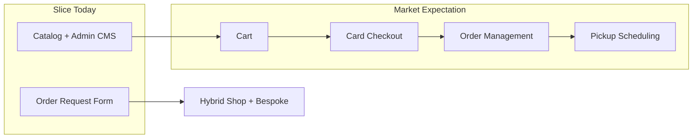
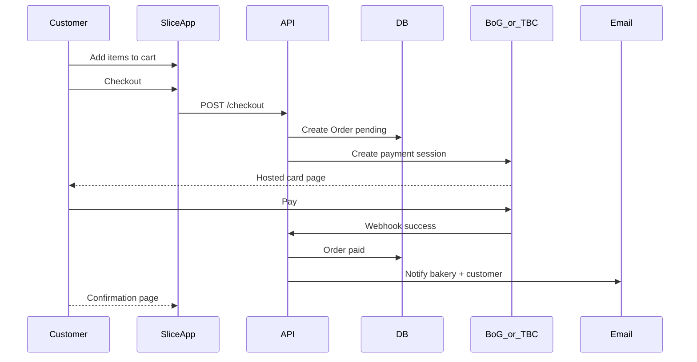

# Bakery Website Competitive Analysis & Slice Roadmap

## Can you compete?

**Yes — for your target market, not against Assorti.**

| Competitor                                                 | Platform feel              | Strengths                                                                                                             | Weaknesses vs Slice opportunity                                           |
| ---------------------------------------------------------- | -------------------------- | --------------------------------------------------------------------------------------------------------------------- | ------------------------------------------------------------------------- |
| [Assorti](https://www.assorti.ge/collections/online-store) | Mature Shopify-scale store | 108 SKUs, cart, card payments (Visa/MC/Apple Pay), pickup scheduling, min order (₾40), free delivery threshold, KA/EN | Enterprise player; overkill for a neighborhood bakery; generic Shopify UX |
| [Madart](https://madart.ge/)                               | Functional but dated       | Full catalog, cart, branches, legal pages, quantity on PDP                                                            | Cluttered UI, weak mobile polish, no clear bespoke-cake workflow          |
| [Belastorti](https://www.belastorti.ge/ka/products/)       | Brochure-style             | Category navigation                                                                                                   | Weak shop UX, "load more" catalog, no obvious online checkout             |
| [Sugarfree](https://www.sugarfree.ge/)                     | Minimal                    | Niche positioning (sugar-free)                                                                                        | Very thin web presence                                                    |

**Your sweet spot:** small-to-medium bakeries with no site (or a weak one). They do not need Assorti-level complexity on day one — they need a professional storefront, card checkout, and easy self-service admin. Slice already beats Belastorti/Madart on design quality; it just lacks commerce.



---

## What Slice already has (your sales pitch today)

Built on a modern stack ([`general.mdc`](.cursor/rules/general.mdc)): React + Vite, Express + Prisma, PostgreSQL, TanStack Query, Tailwind, Docker, CI.

| Area                                  | Status      | Key files                                                                                                        |
| ------------------------------------- | ----------- | ---------------------------------------------------------------------------------------------------------------- |
| Product catalog                       | Done        | [`client/src/features/menu/`](client/src/features/menu/), [`server/src/modules/menu/`](server/src/modules/menu/) |
| Cake detail + guide price             | Done        | [`client/src/pages/cake-detail-page.tsx`](client/src/pages/cake-detail-page.tsx)                                 |
| Admin CMS (cakes, categories, images) | Done        | [`client/src/pages/admin/`](client/src/pages/admin/)                                                             |
| Contact + inquiry capture             | Done        | [`client/src/features/contact/`](client/src/features/contact/)                                                   |
| Custom order request (bespoke)        | Done        | [`client/src/features/order/`](client/src/features/order/)                                                       |
| **Cart / checkout / payments**        | **Missing** | —                                                                                                                |
| Order status workflow                 | Missing     | [`server/prisma/schema.prisma`](server/prisma/schema.prisma) has inquiry-style `Order` only                      |
| Email notifications                   | Stubbed     | TODO in [`server/src/modules/inquiry/inquiry.service.ts`](server/src/modules/inquiry/inquiry.service.ts)         |

Current `Order` model is a **quote request**, not a paid transaction:

```44:55:server/prisma/schema.prisma
model Order {
  id         String    @id @default(cuid())
  name       String
  email      String
  eventType  String
  eventDate  String
  servings   String
  categoryId String?
  category   Category? @relation(fields: [categoryId], references: [id], onDelete: SetNull)
  details    String
  createdAt  DateTime  @default(now())
}
```

---

## What competitors have that you must add

### Tier 1 — Table stakes (you confirmed card + checkout)

1. **Shopping cart** — add to cart from menu/PDP, quantity, persist in Zustand (+ `localStorage`)
2. **Checkout flow** — contact info, delivery vs pickup, address, order summary
3. **Card payments (Georgia)** — use **BoG iPay** or **TBC E-Commerce** hosted checkout (PCI-safe, ~2% commission, T+1 settlement). Stripe is not practical for GE-registered businesses without a foreign entity.
4. **Real order model** — `OrderItem[]`, `subtotal`, `deliveryFee`, `total`, `status`, `paymentId`, `fulfillmentType`
5. **Admin order ops** — view paid orders, update status (`pending` → `confirmed` → `ready` → `delivered`), not read-only like today
6. **Email notifications** — customer confirmation + bakery alert (finish the Resend TODO)

### Tier 2 — Bakery-specific (matches Assorti/Madart, wins deals)

7. **Pickup / delivery scheduling** — Assorti's killer feature: date picker + time slots (e.g. 11:00–12:00). Essential for fresh products.
8. **Minimum order amount** — Assorti enforces ₾40 minimum; configurable per bakery
9. **Free delivery threshold** — Assorti: free shipping above ₾140
10. **Product variants** — size/flavor ("არჩევა" on Assorti, multiple prices on Madart for same cake name)
11. **Sale pricing** — `compareAtPrice` + discount badge (Assorti shows -9%, -25%)
12. **Branch / pickup locations** — Madart lists 5 branches; needed for pickup orders

### Tier 3 — Differentiators (why bakeries pick you over Shopify/agency)

13. **Dual mode: Shop + Bespoke** — keep existing [`/order`](client/src/pages/order-page.tsx) quote flow alongside retail cart. Most competitors only do one or the other poorly.
14. **Deposit for custom cakes** — bespoke shop submits form → bakery sends payment link → customer pays deposit online
15. **Modern mobile UX** — faster, cleaner than Madart/Belastorti; this is already Slice's strength
16. **Self-service admin** — bakeries update menu themselves (you already have this; Assorti needs Shopify expertise)
17. **i18n (KA / EN / RU)** — standard in Georgia; Assorti and Belastorti both offer multilingual

### Tier 4 — Nice-to-have later

- Customer accounts + order history (Madart has phone verification)
- Promotions / coupon codes
- Inventory / daily availability ("sold out today")
- WhatsApp / SMS order alerts
- Analytics dashboard for bakery owner

---

## Recommended deployment model

**Start single-tenant, design for multi-tenant later.**

| Approach                       | Pros                                                                         | Cons                                                  | Recommendation                                            |
| ------------------------------ | ---------------------------------------------------------------------------- | ----------------------------------------------------- | --------------------------------------------------------- |
| **Separate deploy per bakery** | Matches current architecture; custom domain; easy to sell "your own website" | You maintain N instances                              | **Phase 1** — fastest to revenue                          |
| **Multi-tenant SaaS**          | One codebase, recurring billing, scale                                       | Major refactor: tenant isolation, onboarding, billing | **Phase 2** — after 5–10 paying clients prove the product |

Practical path: extract bakery-specific config into env/settings (`BAKERY_NAME`, `MIN_ORDER`, `FREE_DELIVERY_THRESHOLD`, `PAYMENT_GATEWAY_KEYS`, `LOCALES`). Each client gets a Docker deploy or managed hosting. When patterns repeat, add a `Tenant` model.

---

## Suggested implementation phases

### Phase 1 — E-commerce MVP (6–8 weeks)

Goal: A bakery can take online card orders tonight.

**Backend**

- New Prisma models: `Order` (rewrite), `OrderItem`, `Payment`, `OrderStatus` enum
- `POST /api/cart/checkout` → create order → redirect to BoG/TBC hosted payment
- Webhook/callback endpoint for payment confirmation
- Admin: order list with status filters + status update API

**Frontend**

- Cart drawer/page (Zustand store in [`client/src/store/`](client/src/store/))
- Checkout page (3 steps: cart → details → payment redirect)
- Replace "guide price" with real price on PDP; "Add to cart" CTA
- Order confirmation page

**Ops**

- Resend emails on payment success
- README env vars for payment gateway credentials

### Phase 2 — Bakery operations (3–4 weeks)

- Pickup date + time slot selection at checkout
- Configurable min order + delivery fee rules
- `Branch` model for pickup locations
- Product variants (size → price mapping)
- Sale/compare-at pricing on `Cake` model

### Phase 3 — Hybrid product (2–3 weeks)

- Site mode flag: `retail` | `bespoke` | `both`
- Custom order flow links to specific cake; optional deposit payment
- Legal pages template (returns, delivery policy, privacy — Madart has these)

### Phase 4 — Market expansion (ongoing)

- i18n with react-i18next (KA default, EN, RU)
- Customer accounts (optional login, order history)
- Multi-tenant foundation if client count grows

---

## What else to offer bakeries (your service bundle)

Beyond the software, package these to win clients without a website:

1. **Setup package** — menu photography guidance, initial product upload, domain + SSL
2. **Payment onboarding** — help them open BoG/TBC merchant account and connect gateway
3. **Monthly maintenance** — hosting, backups, security updates, menu help
4. **Google Business + Instagram link** — basic local SEO setup
5. **Training** — 30-min admin walkthrough (they manage menu themselves)
6. **Optional add-ons** — professional photo shoot, custom logo, printed QR menu linking to shop

**Pricing angle:** A one-time setup fee (e.g. ₾800–1500) + monthly hosting/support (₾50–150) undercuts a custom agency build and avoids Shopify monthly fees + theme costs.

---

## Honest competitive positioning

| Claim                                   | Valid?                                         |
| --------------------------------------- | ---------------------------------------------- |
| "Compete with Assorti"                  | No — they are a 300+ employee chain on Shopify |
| "Better than most local bakery sites"   | Yes — after Phase 1–2                          |
| "Works for shops with no website"       | Yes — this is the real market                  |
| "Card checkout included"                | Only after Phase 1 payment integration         |
| "Custom wedding cakes + daily pastries" | Yes — dual mode is your unique angle           |

**Elevator pitch:** _"A modern bakery website with online card payments, pickup scheduling, and a custom cake inquiry form — managed by you, without Shopify complexity."_

---

## Architecture sketch (post Phase 1)



---

## Key risks to plan for

- **Payment merchant accounts** — bakeries need a business bank account (BoG/TBC); factor 1–2 weeks onboarding into your sales timeline
- **Fresh product logistics** — scheduling + lead times prevent "order now, expect in 10 min" failures
- **Scope creep** — resist building Assorti-level inventory/ERP; stay focused on storefront + orders
- **Legal** — terms, privacy policy, cookie consent for GE market (template + lawyer review once)
