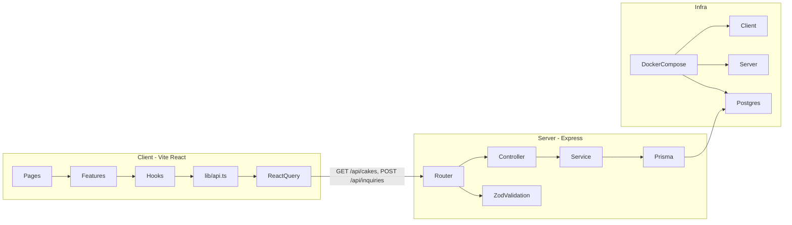

# Slice — Cake Website Build Plan

Greenfield project at [`/Users/macbookair/Desktop/Coding/Portfolio/Slice`](.). No existing files. Implementation follows the spec's 12-step order, grouped into 6 phases.

## Architecture Overview



---

## Phase 1 — Monorepo Scaffold & Tooling

### Root layout

Create the folder tree from the spec. Add a **root** [`package.json`](package.json) (not in spec but required for Husky/lint-staged) with workspace scripts:

```json
{
  "scripts": {
    "dev": "docker compose up",
    "lint": "npm run lint --workspaces",
    "format": "prettier --write \"**/*.{ts,tsx,js,json,md}\""
  }
}
```

Use **npm** (matches Dockerfiles). Client and server each get their own `package.json`.

### Client (`client/`)

- `npm create vite@latest` with React + TypeScript template
- Dependencies: `react-router-dom`, `@tanstack/react-query`, `zustand`, `zod` (for form validation mirroring server)
- Dev: `tailwindcss`, `postcss`, `autoprefixer`, `eslint`, `prettier`, `@typescript-eslint/*`
- [`tsconfig.json`](client/tsconfig.json): `"strict": true`, path aliases (`@/` → `src/`)
- [`vite.config.ts`](client/vite.config.ts): `@` alias, proxy `/api` → `http://localhost:3001` for local dev outside Docker
- Tailwind config with design tokens:

| Token           | Value     |
| --------------- | --------- |
| `bg-warm`       | `#FAF7F4` |
| `text-espresso` | `#1C1209` |
| `accent-rose`   | `#D4967A` |
| `accent-sage`   | `#8A9E8C` |
| `surface-cream` | `#F2EDE7` |

- Google Fonts: **Cormorant Garamond** (display) + **DM Sans** (body) in [`index.html`](client/index.html)

### Server (`server/`)

- Dependencies: `express`, `@prisma/client`, `zod`, `cors`, `helmet`, `dotenv`
- Dev: `typescript`, `tsx`, `prisma`, `eslint`, `prettier`, `@types/express`, `@types/cors`, `@types/node`
- [`tsconfig.json`](server/tsconfig.json): `"strict": true`, `"module": "NodeNext"`
- Scripts: `dev` (tsx watch), `build`, `start`, `db:migrate`, `db:seed`, `db:studio`

### Shared tooling

- [`.gitignore`](.gitignore) — `node_modules`, `.env`, `dist`, `pgdata`
- [`.env.example`](.env.example) — as specified
- ESLint + Prettier configs in both packages (extend recommended TS rules, no `any`)
- **Husky + lint-staged** at root: lint-staged runs ESLint + Prettier on staged `client/**` and `server/**` files

---

## Phase 2 — Cursor Rules & Docker

### `.cursor/rules/` (5 files, `.mdc` with frontmatter)

| File                                                           | `description`                  | Key rules                                                           |
| -------------------------------------------------------------- | ------------------------------ | ------------------------------------------------------------------- |
| [`general.mdc`](.cursor/rules/general.mdc)                     | Stack overview and conventions | Strict TS, naming, conventional commits, README updates             |
| [`project-structure.mdc`](.cursor/rules/project-structure.mdc) | Monorepo layout                | Feature folders, barrel `index.ts` exports                          |
| [`frontend-rules.mdc`](.cursor/rules/frontend-rules.mdc)       | Applies to `client/**`         | API via `lib/api.ts`, React Query hooks, typed Props, Tailwind only |
| [`backend-rules.mdc`](.cursor/rules/backend-rules.mdc)         | Applies to `server/**`         | Controller/service split, `config/env.ts`, error middleware, Zod    |
| [`database-rules.mdc`](.cursor/rules/database-rules.mdc)       | Applies to `server/prisma/**`  | Migrations only, Prisma singleton, idempotent seed                  |

### Docker

- [`docker-compose.yml`](docker-compose.yml) — exactly as spec (db healthcheck, volume mounts for hot reload)
- [`server/Dockerfile`](server/Dockerfile) and [`client/Dockerfile`](client/Dockerfile) — as spec
- Server entry waits for DB: run `prisma migrate deploy` then `npm run dev` via a small [`server/docker-entrypoint.sh`](server/docker-entrypoint.sh) so migrations apply on first `docker compose up`

---

## Phase 3 — Database & Backend

### Prisma ([`server/prisma/schema.prisma`](server/prisma/schema.prisma))

`Cake` and `Inquiry` models exactly as spec. Run `prisma migrate dev --name init` to create the first migration (never `db push`).

### Seed ([`server/prisma/seed.ts`](server/prisma/seed.ts))

- 8+ cakes across Wedding, Birthday, Seasonal, Custom
- **Idempotent**: `upsert` on a stable `name` field (or delete-and-reseed in dev only — upsert is safer)
- `featured: true` on 3 cakes for Home page
- Images: `https://picsum.photos/seed/{slugified-name}/600/400`

### Server structure

```
server/src/
├── index.ts              # Express app, CORS (CLIENT_URL), mount routers
├── config/env.ts         # Typed env object — sole process.env reader
├── lib/prisma.ts         # Singleton PrismaClient
├── middleware/
│   ├── errorHandler.ts   # Catches AppError + Zod errors, no stack traces
│   ├── logger.ts         # Request logging
│   ├── validate.ts       # Generic Zod body/query validator
│   └── auth.ts           # Placeholder: next() always, JWT hook point
└── modules/
    ├── menu/             # cakes
    └── inquiry/          # contact form
```

### API implementation

**Response envelope** (all endpoints):

```ts
{ data: T, meta?: { total: number } }
```

| Method | Route            | Behavior                                                                |
| ------ | ---------------- | ----------------------------------------------------------------------- |
| GET    | `/api/health`    | `{ data: { status: "ok" } }`                                            |
| GET    | `/api/cakes`     | Filter `?category=` and `?featured=true`, only `available: true`        |
| GET    | `/api/cakes/:id` | Single cake or 404                                                      |
| POST   | `/api/inquiries` | Zod validate `{ name, email, message }`, persist, return created record |

- Zod schemas in `*.schema.ts`; validation middleware runs before controllers
- Controllers: parse → call service → `res.json({ data, meta })`
- Services: all Prisma calls; inquiry service structured with a `// TODO: plug in Resend mailer` hook
- Custom `AppError` class with `statusCode` for 404/400/500

---

## Phase 4 — Frontend Foundation

### Core files

| File                                                               | Purpose                                                                       |
| ------------------------------------------------------------------ | ----------------------------------------------------------------------------- |
| [`client/src/lib/api.ts`](client/src/lib/api.ts)                   | Typed `fetch` wrapper using `import.meta.env.VITE_API_URL`; throws on non-2xx |
| [`client/src/lib/query-client.ts`](client/src/lib/query-client.ts) | TanStack Query defaults                                                       |
| [`client/src/types/cake.ts`](client/src/types/cake.ts)             | `Cake`, `Inquiry`, `ApiResponse<T>` — extractable later                       |
| [`client/src/routes/index.tsx`](client/src/routes/index.tsx)       | React Router v6: `/`, `/menu`, `/about`, `/contact`                           |
| [`client/src/store/ui.ts`](client/src/store/ui.ts)                 | Zustand placeholder (e.g. mobile nav open state)                              |

### Layout components (`components/layout/`)

- **Header** — logo/wordmark, nav links, mobile menu toggle (Zustand)
- **Footer** — brand, nav, copyright
- **PageWrapper** — consistent max-width + padding

### UI primitives (`components/ui/`)

- `Button`, `Card`, `Input`, `Textarea`, `Badge` (category pills), `Spinner`
- Each with typed `Props` interface; barrel `index.ts` exports

---

## Phase 5 — Pages & Features

### Home (`/`)

- Full-bleed hero: large cake image with serif headline overlaid (not stacked)
- Brand statement, 3 featured cakes grid (React Query `useFeaturedCakes`), CTA → `/menu`
- Subtle fade-in-up on scroll (CSS `@keyframes` + `IntersectionObserver` hook in [`client/src/hooks/use-fade-in.ts`](client/src/hooks/use-fade-in.ts))

### Menu (`/menu`)

- Feature folder: [`client/src/features/menu/`](client/src/features/menu/)
  - `hooks/use-cakes.ts` — `useQuery` with category filter param
  - `components/CakeCard.tsx` — image, name, price, category badge; hover lift + shadow
  - `components/CategoryFilter.tsx` — Wedding | Birthday | Seasonal | Custom | All
- Grid layout, generous whitespace, no borders

### About (`/about`)

- Editorial layout: brand story, values list, warm photography placeholder
- Serif headings, sans body — "made with love" tone

### Contact (`/contact`)

- Feature folder: [`client/src/features/contact/`](client/src/features/contact/)
  - `hooks/use-submit-inquiry.ts` — `useMutation` → `POST /api/inquiries`
  - `components/ContactForm.tsx` — name, email, message; client-side Zod validation
  - Success/error states inline (no toast library needed yet; Zustand toast store is optional later)

---

## Phase 6 — Polish & Documentation

- **Responsive**: mobile-first breakpoints; hero image crops gracefully; menu grid 1→2→3 cols
- **Motion**: card hover `translate-y` + `shadow-lg` transition; scroll fade-in only (no heavy animation libs)
- **README.md**: setup (Docker + local), env vars, scripts (`dev`, `db:migrate`, `db:seed`, `lint`), API docs, design tokens
- **Commits** (conventional, one per major phase):
  - `chore: scaffold monorepo with tooling`
  - `chore: add cursor rules and docker compose`
  - `feat: add prisma schema, migrations, and seed`
  - `feat: implement express api for cakes and inquiries`
  - `feat: scaffold react app with routing and layout`
  - `feat: add home, menu, about, and contact pages`

---

## Key Conventions (enforced throughout)

- **No `any`** — strict TypeScript everywhere
- **No `fetch` in components** — only via `lib/api.ts` inside feature hooks
- **No `process.env` outside `config/env.ts`** on server
- **Barrel exports** — every `components/` and `features/` subfolder gets `index.ts`
- **File naming** — `kebab-case.ts` / `kebab-case.tsx`

## Verification Checklist

After build, confirm:

1. `docker compose up` starts db + server + client without errors
2. `GET http://localhost:3001/api/cakes` returns seeded cakes with envelope shape
3. `POST http://localhost:3001/api/inquiries` persists and returns data
4. All 4 routes render at `http://localhost:5173`
5. Menu category filter updates the cake list
6. Contact form shows success state after submit
7. `npm run lint` passes in both packages
8. Pre-commit hook runs lint-staged on a test commit
